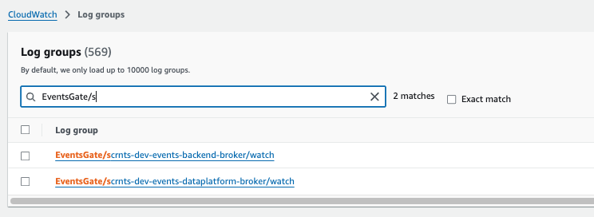
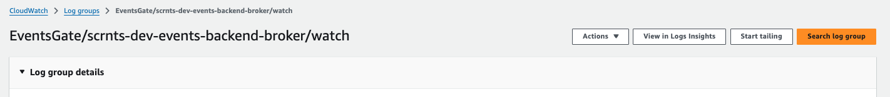
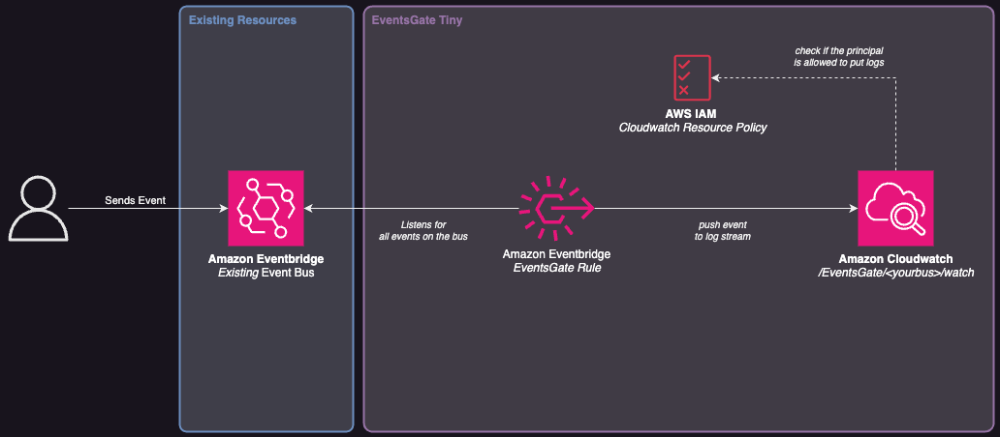

# Events Gate TINY
*EventsGate "Tiny edition"* is a solution for debugging and monitoring events across all EventBridge buses in your AWS account.  
This stack creates an EventBridge rule that captures all events from a specified event bus (or the default bus if none is specified) and stores them in a dedicated CloudWatch Log Group.  
By centralizing events into a single log group, this solution simplifies troubleshooting, auditing, and debugging workflows across your AWS environment.

#### What's the TINY edition
We are working on a slightly larger product for dinamically monitoring all your event buses with a UI and a custom deployment mdoel. If interested you should check out the [AWS-EVENTS-GATE repo](https://github.com/aka-somix/aws-events-gate)


## 📖 Usage
Following a brief guide about how to use this tool

#### Step 1 - Deploy Events Gate tiny to your aws account 
You can deploy this tool multiple time for the same account, attaching an events gate to *each event bus* you need to monitor.  
The deployment is available through multiple IaC tools, feel free to pick your fav 💕.

Please, reference the section `Launch on your account` for info about how to deploy the tool.

#### Step 2 - Locate the Cloudwatch Group where events are streamed
* Log into your AWS Account and search for the `Amazon Cloudwatch` service.
* From the side bar menu, search and navigates into `Logs > Log Groups`.
* Use the search bar to look up for a cloudwatch group formatted like this
    > EventsGate/\<your-event-bus\>/watch

    
* Click on the desired log group

#### Step 3 - Look at the events passing through the events gate
Once inside the Cloudwatch log group you can either look at past events still retained (look at the retention period. It should be 1 Day by default), or snif events passing through the gate on the go.

You can leverage the `Start Tailing` button to look at events in realtime as they come:



**Congrats 🎉 You are now ready to use EventsGate Tiny**

## 🚀 Launch on your account

The project comes with different options for deployment in your account.

### General Prerequisites
* AWS Account with permissions to create EventBridge and CloudWatch resources.

* AWS CLI installed and configured with credentials.

### Amazon CDK

To launch with cdk you will need additional libraries:
* Node and a package manager (example: **pnpm**)

Furthermore, your account should be bootstrapped for using CDK. [More here](https://docs.aws.amazon.com/cdk/v2/guide/bootstrapping.html).

Once everything is set, do the following:
1. Go to `cdk` folder
2. Install dependencies
    ```bash
    pnpm i
    ```
1. Run the deploy commmand passing the bus to monitor as context variable:
    ```
    pnpm cdk deploy -c bus=<your_event_bus>
    ```
    If no `bus` is provided then the *default bus* will be used.

#### Applying custom tags
You can apply custom tags to resources by adding a `.tags.json`. For more info [read this doc](./cdk/lib/tags/README.md).

### OpenTofu
To launch with tofu you will need additional libraries:
* Tofu

You can use 

1. Go to `tofu` folder
2. Initialize the backend with:
    ```
    tofu init
    ```
3. Apply using your own `.tfvars` file:
    ```
    tofu apply --var-file="vars.tfvars"
    ```
    You can set the `eventbus_name` in the .tfvars file. If no `bus` is provided then the *default bus* will be used.

#### Applying custom tags
You can apply custom tags to resources by using the `tags` variables in the tfvars

## 🔎 Architecture Diagram



## 💰 How much does this solution cost?

The provided solution is mainly based on **serverless** components, therefore the costs should be relatively low, especially if used for debugging with low traffic event buses.  
Nevertheless, the main elements of cost to keep under control to avoid excessive spendings are:

* Number of events passing through the monitored bus
* Amount of data stored in Amazon Cloudwatch. Please note that default settings only store the received events as logs for **1 Day**


## 📞 Support and Contacts
This tool is (currently) made and maintained with 💜 by [aka-somix](https://github.com/aka-somix). 
For any bug or feature request feel free to open a Issue in the dedicated section of this repository.


## 📎 External Sources and credits
The solution is based on a reference architecture documented and available on [Serverless Land](https://serverlessland.com/patterns/eventbridge-cloudwatch)

